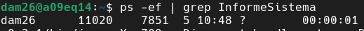
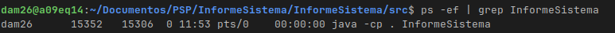
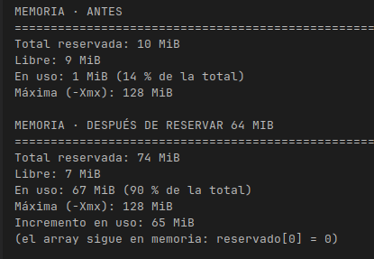

PARTE 1

PARTE 2

PPID: 7851

PID: 11020

El PPID es 7851 ya que es el proceso de Intelligi y el PID es la ejecucion del programa.

El PPID si que cambia ya que el localizador pasara de ser el del IDE al de la consola.

Despues de aplicar la limitacion, podemos ver que tenemos mas espacio libre que cuando se ejecuto
la parte 1 utiliza un poco mas de espacio ya que el 1 usa 3MiB y el limitado solo 1 MiB.

La ruta se ajsuta a cada sistema operativo debido a que usamos un sistema en el que la barra separadora y
la ruta principal se adapta al SO detectado ya que en windows para separar se usa \ y en linux /

PARTE 3

● a) Un servidor web que atiende 500 peticiones a la vez en una máquina de 8 núcleos.

Yo usaria la programacicon concurrente ya que mientras hay operaciones en espera se iran ejecutando otras,
lo malo son los posibles problemas de sincronizacion de datos.

● b) Renderizar una película de animación en un plazo de tres meses.

Usaria la programación distribuida ya que la renderizacion es una tarea muy pesada, asi aliviaremos el trabajo por equipo sinedo mas eficientes,
un gran problema serian la posible sobrecarga de la red debido al paso de archivos de gran tamaño

● c) Una app de móvil que descarga un fichero mientras seguís navegando.

La mejor opcion es la programación concurrente ya que se divide la tarea de la descarga mientras se utiliza el movil se intercalan los procesos

● d) Un cálculo que no cabe en la RAM de un solo equipo

Programacion distribuida ya que si un equipo no puede con esa tarea es obligatorio dividirla lo malo
es que la veloocidad entre ir a la ram e ir a otro equipo es mucho mas lento ir al otro equipo.
